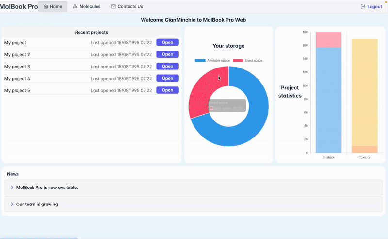

<div align="center">

# MolBook Web

<div align="center" style="display: flex; justify-content: center; gap: 1rem;">

  
  

</div>


[](https://opensource.org/licenses/MIT)
[](https://GitHub.com/Kohulan/DECIMER-Image_Transformer/graphs/commit-activity)
[](#)
[](#)
[](#)
[](#)
[](#)
[](#)
[](#)
[](#)

</div>


**MolBook Web** is a web-based application designed to help researchers and chemists manage, visualize, and analyze molecular data. It provides an intuitive user interface for storing, organizing, and exploring chemical structures and their associated information.

## 🚀 Features

* **Import & Export:** Support for popular molecular data formats (e.g., SDF, SMILES).
* **Interactive Visualization:** Display chemical structures in a clear, interactive manner.
* **Advanced Search:** Easily search and filter molecules by various properties.
* **Annotations & Collections:** Annotate molecules and organize them into custom collections.
* **User Management:** Secure authentication system with JWT, including role-based access.

## 🛠️ Technologies

### Backend

* **Python (Django 5.2)**
* Django REST Framework
* JWT Authentication (`dj-rest-auth`, `SimpleJWT`)
* SQLite (development database)

### Frontend

* **React.js**
* PrimeReact (UI Components)
* Vite (build tool)

## ⚙️ Prerequisites

Make sure you have installed:

* **Python** (>= 3.10)
* **Node.js** (>= 18.x)
* **npm** (>= 9.x)

## 📦 Installation & Setup

Clone the repository:

```bash
git clone https://github.com/yourusername/molbook_web.git
cd molbook_web
```

### Backend Setup (Django):

1. Navigate to backend directory and create a virtual environment:

```bash
cd backend
python -m venv venv
source venv/bin/activate  # Linux/macOS
.\venv\Scripts\activate   # Windows
```

2. Install backend dependencies:

```bash
pip install -r requirements.txt
```

3. Set up the database:

```bash
python manage.py migrate
```

4. Start the Django development server:

```bash
python manage.py runserver
```

The backend API is accessible at `http://localhost:8000`.

### Frontend Setup (React):

1. Navigate to frontend directory and install dependencies:

```bash
cd ../frontend
npm install
```

2. Start the React development server:

```bash
npm run dev
```

Access the frontend at `http://localhost:5173`.

## 📖 Usage

* Frontend Application: [http://localhost:5173](http://localhost:5173)
* API Root Endpoint: [http://localhost:8000](http://localhost:8000)

Default admin panel available at:

* Django Admin: [http://localhost:8000/admin](http://localhost:8000/admin)

## 🤝 Contributing

Contributions are welcome! To contribute:

* Fork the repository
* Create a new branch (`git checkout -b feature/my-feature`)
* Commit your changes (`git commit -m 'Add some feature'`)
* Push to your branch (`git push origin feature/my-feature`)
* Open a pull request

Please open issues to suggest new features or report bugs.

## 📄 License

This project is licensed under the **MIT License**.
